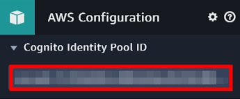

## Create an Amazon Sumerian Chatbox with Amazon Lex and AWS Amplify

## Overview


<center>

</center>

Amazon Lex is a service for building conversational interfaces into any application using voice and text. As a fully managed service, you don’t need to worry about managing infrastructure. 

Amazon Sumerian lets you create and run virtual reality (VR), augmented reality (AR), and 3D applications quickly and easily without requiring any specialized programming or 3D graphics expertise.

AWS Amplify makes it easy to create, configure, and implement scalable mobile and web apps powered by AWS.

## Scenario
In this lab, you will learn how to set up an AWS Amplify React app to hold a Sumerian Chatbot scene for both authenticated and unauthenticated users to access.

## Preparation

- AWS account
- Recommend to use [VScode](https://code.visualstudio.com/) for this lab.


## Create an Amazon Lex Chatbot
We use Amazon Lex template provided in this tutorial.

- On the __Service__ menu, click __Amazon Lex__, choose __Create__.

- Choose __BookTrip__ template, type __Bot name__ : `yourbotname`, and then __Create__.

<center>

</center>

- Choose the bot created before, click __Settings__, choose __Aliases__.

    __Alias name__ : `test`

    __Bot version__ : `latest`

- - Click __PLUS__ icon to add a new alias.

<center>

</center>

- Slect __Publish__. 

    - __Choose an alias__ : `test `, and __Publish__.

<center>

</center>

> Waiting for publish, and you can close the page.

## Install AWS Amplify CLI

__Open Visual Studio Code's terminal__, Using command line to install AWS Amplify CLI.

- Install [Node.js](https://nodejs.org/en/download/) and [npm](https://www.npmjs.com/get-npm) if they are not already on your machine.

> You need to restart computer to ensure the VScode can run Node.js and npm.

- Type `node -v` and `npm -v` in a VScode terminal window to verify Node.js and npm version.

    - Node.js : 8.x.x (at least).

    - npm : 5.x.x  (at least).


<center>

</center>

- Use `npm install -g @aws-amplify/cli` to install __Amplify CLI__.

- Type `amplify configure` to configure Amplify CLI.

> If you want to use __exsisting IAM User__, please press "enter" to ignore the first two question, and then paste your __accessKeyId & secretAccessKey__.


<center>

</center>

<center>

</center>

### Create a React App with Amplify

Using command line to create react app.

- Create react app by using __create-react-app__, `npx create-react-app sumerian-amplify-app`.

> The file will default create in __C:\Users\USER\sumerian-amplify-app__.

- Change to react project with `cd sumerian-amplify-app`.


- Install the __aws-amplify__ and __aws-amplify-react__ libaries with `npm install aws-amplify aws-amplify-react --save`.

### Initialize a new AWS Amplify project

- Initialize the cloud resources for our app, type `amplify init` in terminal.

> It will prompt you with a few questions.

<center>

</center>


- Select __NO__ when ask __"Do you want to use an AWS profile"__, and paste your AWS account __accessKeyId__ and __secretAccessKey__.

<center>

</center>

- Select the __region__ where your __Sumerian scene__ published.

<center>

</center>

> It take a few minutes to initialize and connect to the cloud.


<center>

</center>

- Use `amplify push` to provision the initial cloud resources for our app.

### Add Config in AWS Amplify Project

- Open __sumerian-amplify-app__ project with [Visual Studio Code](https://code.visualstudio.com/)

- Update the __App.js__.
    
    Replace `your_scene_region` in line 13.
    > For eaxample : us-east-1

    Replace `your_scene_name` in line 15, 28.

```
import React, { Component } from 'react';
import './App.css';
import aws_exports from './aws-exports';
import Amplify, { XR } from 'aws-amplify';
import scene_config from './sumerian-exports';
import { withAuthenticator, SumerianScene  } from 'aws-amplify-react';
import AWS from 'aws-sdk';
new AWS.Polly();


 XR.configure({ // XR category configuration
   SumerianProvider: { // Sumerian-specific configuration
     region: '<your_scene_region>', // Sumerian scene region
     scenes: {
       "<your_scene_name>": {   // Friendly scene name
           sceneConfig: scene_config // Scene JSON configuration
         },
     }
   }
 });

 Amplify.configure(aws_exports);

 class App extends Component {
    render() {
      return (
        <body> {}
          <SumerianScene sceneName='<your_scene_name>'/>
        </body>
      );
    }
  }

 export default withAuthenticator(App, { includeGreetings: true });
```
- Insert the fowlling content in __Index.css__.

```
body {
  height: 600px;
}
```

### Add an Authentication Service to the Amplify Project

- Get into your __sumerian-amplify-app__ folder in terminal.

- Type `amplify add auth` in terminal, select __Yes__ to use the default configuration.

<center>

</center>

- Type `amplify push` to update CloudFormation stack.

> NOTES : It will take a few minuites to update the stack.


- Extend the __amplify / backend__ folder, open the __amplify-meta.jason__.


<center>

</center>

- Note the __UnauthRoleName__ and __AuthRoleName__ and __IdentityPoolName__, we will use it later.


<center>

</center>

<center>

</center>


- Back to AWS console click __Services__, select __IAM__.


- Choose __Roles__, search your __UnAuthRoleName__ and click in.

- Select __Add inline policy__.


<center>

</center>

- Select __JSON__, and paste the fowlling content.

```
{
    "Version": "2012-10-17",
    "Statement": [
        {
            "Effect": "Allow",
            "Action": [
                "cloudwatch:GetMetricStatistics",
                "cloudwatch:DescribeAlarms",
                "cloudwatch:DescribeAlarmsForMetric",
                "kms:DescribeKey",
                "kms:ListAliases",
                "lambda:GetPolicy",
                "lambda:ListFunctions",
                "lex:*",
                "polly:DescribeVoices",
                "polly:SynthesizeSpeech"
            ],
            "Resource": [
                "*"
            ]
        },
        {
            "Effect": "Allow",
            "Action": [
                "lambda:AddPermission",
                "lambda:RemovePermission"
            ],
            "Resource": "arn:aws:lambda:*:*:function:AmazonLex*",
            "Condition": {
                "StringLike": {
                    "lambda:Principal": "lex.amazonaws.com"
                }
            }
        },
        {
            "Effect": "Allow",
            "Action": [
                "iam:GetRole",
                "iam:DeleteRole"
            ],
            "Resource": [
                "arn:aws:iam::*:role/aws-service-role/lex.amazonaws.com/AWSServiceRoleForLexBots",
                "arn:aws:iam::*:role/aws-service-role/channels.lex.amazonaws.com/AWSServiceRoleForLexChannels"
            ]
        },
        {
            "Effect": "Allow",
            "Action": [
                "iam:CreateServiceLinkedRole"
            ],
            "Resource": [
                "arn:aws:iam::*:role/aws-service-role/lex.amazonaws.com/AWSServiceRoleForLexBots"
            ],
            "Condition": {
                "StringLike": {
                    "iam:AWSServiceName": "lex.amazonaws.com"
                }
            }
        },
        {
            "Effect": "Allow",
            "Action": [
                "iam:DeleteServiceLinkedRole",
                "iam:GetServiceLinkedRoleDeletionStatus"
            ],
            "Resource": [
                "arn:aws:iam::*:role/aws-service-role/lex.amazonaws.com/AWSServiceRoleForLexBots"
            ]
        },
        {
            "Effect": "Allow",
            "Action": [
                "iam:DetachRolePolicy"
            ],
            "Resource": [
                "arn:aws:iam::*:role/aws-service-role/lex.amazonaws.com/AWSServiceRoleForLexBots"
            ],
            "Condition": {
                "StringLike": {
                    "iam:PolicyArn": "arn:aws:iam::aws:policy/aws-service-role/AmazonLexBotPolicy"
                }
            }
        },
        {
            "Effect": "Allow",
            "Action": [
                "iam:CreateServiceLinkedRole"
            ],
            "Resource": [
                "arn:aws:iam::*:role/aws-service-role/channels.lex.amazonaws.com/AWSServiceRoleForLexChannels"
            ],
            "Condition": {
                "StringLike": {
                    "iam:AWSServiceName": "channels.lex.amazonaws.com"
                }
            }
        },
        {
            "Effect": "Allow",
            "Action": [
                "iam:DeleteServiceLinkedRole",
                "iam:GetServiceLinkedRoleDeletionStatus"
            ],
            "Resource": [
                "arn:aws:iam::*:role/aws-service-role/channels.lex.amazonaws.com/AWSServiceRoleForLexChannels"
            ]
        },{
            "Effect": "Allow",
            "Action": [
                 "sumerian:ViewRelease"
             ],
             "Resource": [
                "*"
            ]

        },
        {
            "Effect": "Allow",
            "Action": [
                "iam:DetachRolePolicy"
            ],
            "Resource": [
                "arn:aws:iam::*:role/aws-service-role/channels.lex.amazonaws.com/AWSServiceRoleForLexChannels"
            ],
            "Condition": {
                "StringLike": {
                    "iam:PolicyArn": "arn:aws:iam::aws:policy/aws-service-role/LexChannelPolicy"
                }
            }
        }
    ]
}
```
- Click __Review policy__, name your policy and then __Create policy__.

> This policy will allow your Sumerian scene to use Amazon Lex and allow your app to load the Amazon Sumerian scene.

- __Attach the same Inline policies to AuthRolename with the same steps as UnauthRolename.__.

- Click __Services__, select __Cognito__. 

- Select __Manage Identity Pools__.

- Search for your __IdentityPoolName__ and click __Edit identity pool__ on  the upper right corner.

- Extend the __Unauthenticated identities__, check the __Enable access to unauthenticated identities__ option.

<center>

</center>

- Copy the __Identity pool ID__, we will use it later.

<center>

</center>

### Create an Amazon Sumerian Scene

- On the __Service__ menu, click __Amazon Sumerian__, you will get into the __Amazon Sumerian Dashboard__.


- Select __Create new scene__, and type your __Scene name__.

- Click the Entities of __yourscenename__ on the upper left corner, and then extend the __AWS Configuration__ on the right side.


<center>

</center>

- Extend the __AWS Configuration__, update the __Cognito Identity Pool ID__ you copy before.


<center>

</center>

- Click __Import Assets__, choose __Maya__ and select __Add__ to add a host.


<center>

</center>


- __Maya__ will show in the __Assets__ on your left side.

<center>

</center>


- Drop the __Maya__ in your scene, you will see __Maya__.


<center>

</center>

> Note : You may need to zoom in to see Maya.

<center>

</center>

### Adding the Dialogue Component

- Select __Maya__ entities, and click __Add component__, choose __Dialogue__.


<center>

</center>

- Insert the values for __Name__ and __Alias__, these inputs reference the Amazon Lex chatbot what you created.


<center>

</center>

### Creating a Chatbot Behavior Using the State Machine


- Select __Maya__ entities, and click __Add component__, choose __State Machine__.


<center>

</center>

- Open the __State Machine__, click __PLUS__ button to add a new behavior.


<center>

</center>

- Rename the __name__ : `ChatBot`.

<center>

</center>

- Rename __State 1__ : `Start`, and choose __Add Action__.


<center>

</center>

- Search for and __add__ `AWS SDK Ready`.


<center>

</center>


- Click __Add State__ for __five__ times to create five states.


<center>

</center>

-  Choose the new state, and __rename__ it.

    __State 1__ : `Wait for Input`

    __State 2__ : `Start Recording`

    __State 3__ : `Stop Recording`

    __State 4__ : `Process with Lex`

    __State 5__ : `Play Response`


<center>

</center>

- Click state __Wait for Input__, add a __Key Down__ action.


<center>

</center>

- Change the key : __T__.


<center>

</center>

- Click state __Start Recording__, add  __Start Microphone Recording__ and __Key Up__ action.


<center>

</center>


- Click state __Stop Recording__, add a __Stop Microphone Recording__ action.


<center>

</center>


- Click state __Process with Lex__, add a __Send Audio Input to Dialogue Bot__ action.


<center>

</center>

> Do not select Log user input or Log bot respons.


- Click state __Play Response__, add a __Start Speech__ action and select __Use Lex Response__.


<center>

</center>


- Adding transitions by __clicking__ the state and __dragging__ the arrow to another state

> On the Process With Lex state, drag the transition from the "On Response Ready output".


<center>

</center>

> The final graph will look like the following.

<center>

</center>

### Publish Amazon Sumerian Scene Privately

- Select __Publish__ on upper right corner, choose __Host privately__ and __Publish__.

> If you are already published, click unpublish.


<center>

</center>

<center>

</center>

- You will see a JSON file, __Download JSON configuration__.

- Drag the JSON file in __src__ folder and rename it to `sumerian-exports.js`.


<center>

</center>

- Update the content of __sumerian-export.js__ as fowlling.


<center>

</center>

### Run the React App

- Type `npm start` to run your app in local.

<center>

</center>

> It will run on your browser.

- __Create account__ and __Login__, you will see the Sumerian scene.


<center>

</center>

<center>

</center>

- Press __T__ to talk with her.

> You can say "Book a hotel" or "Book a car" to start the dialogue.

> You can press "Ctrl+c" in terminal to end this work.

### Running on a VR or AR Device

- Type `amplify add hosting` to set up.

- Choose __DEV__ to create a S3 hosting bucket.

<center>

</center>

- Insert your __hosting bucket name__, and choose the fowlling option.

<center>

</center>

- Type `amplify publish` to publish your Amplify project.

> This publishes the app to a live URL, you can open the URL in any browser or VR headset.

<center>

</center>

## Conlusion
We now have learned how to:
- Install AWS Amplify CLI.
- Create a React app.
- Publish Sumerian scene privately.
- Use AWS Amplify to depoly an app.


## Reference
- [Using the Dialogue Component and Amazon Lex to Build a Chatbot](https://docs.sumerian.amazonaws.com/tutorials/create/beginner/dialogue-component/)