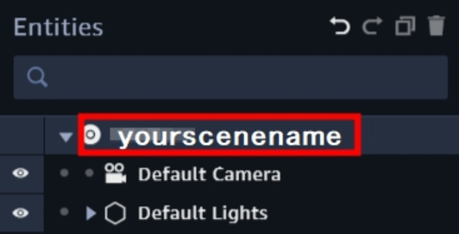

## Create a Virtual assistant app with Amazon Lex and AWS Amplify

## Overview


<center>

</center>

AWS Amplify recently added support for augmented reality (AR) and virtual reality (VR) content within your applications. The XR category has built-in support for Amazon Sumerian.

Amazon Lex is a service for building conversational interfaces into any application using voice and text. As a fully managed service, you don’t need to worry about managing infrastructure. 

Amazon Sumerian lets you create and run virtual reality (VR), augmented reality (AR), and 3D applications quickly and easily without requiring any specialized programming or 3D graphics expertise.

AWS Amplify makes it easy to create, configure, and implement scalable mobile and web apps powered by AWS.

## Scenario
We can design Amazon Lex chatbot according to different situations and cooperate with AWS Amplify to automatically depoly the application. We doesn't worry about the backend program and hardware load problem at all, just focus on the design of the main code. The Amazon Sumerian scene can be quickly deployed in various installations, suitable for interactive receptionists of various large-scale exhibition events or various simulation teaching materials.

## Preparation

- Region in US East (N. Virginia)
- Recommend to use [VScode](https://code.visualstudio.com/) for this lab, because it can edit project and use command line at the same time.


### Create an Amazon Lex Chatbot
First, we used Amazon Lex default "BookTrip" template to simplify the process to create the theme of this chatbot. The robot will detect the intent to judge the user's intentions, and reply to the relevant dialogue or make corresponding actions. For example, the robot will continuously ask the user around the theme of "BookTrip" and finally make a reservation. Or the action of renting a car.

- On the __Service__ menu, click __Amazon Lex__, choose __Create__.

- Choose __BookTrip__ template, type __Bot name__ : `yourbotname`, and then __Create__.

<center>

</center>

- Choose the bot created before, click __Settings__, choose __Aliases__.

    - Setting as following : 

        - __Alias name__ : `test`

        - __Bot version__ : `latest`
        > It will give a different alias name for different version for each time.

- Click __PLUS__ icon to add a new alias.

<center>

</center>

- Slect __Publish__. 

    - __Choose an alias__ : `test `, and __Publish__.

<center>

</center>

> Waiting for publish, and you can close the page.

### Design AWS Amplify project

__Open Visual Studio Code's terminal__, Using command line to install AWS Amplify CLI.

- [AWS Amplify CLI install](https://aws-amplify.github.io/docs/)

- Create react app by using __create-react-app__, `npx create-react-app sumerian-amplify-app`.

> The file will default create in __C:\Users\USER\sumerian-amplify-app__.

- Change to react project with `cd sumerian-amplify-app`.


- Install the __aws-amplify__ and __aws-amplify-react__ libaries with `npm install aws-amplify aws-amplify-react --save`.


- Open __sumerian-amplify-app__ project with [Visual Studio Code](https://code.visualstudio.com/)

- Update the [__App.js__](App.js).
    
    Replace `your_scene_region` in line 13.
    > For eaxample : us-east-1

    Replace `your_scene_name` in line 15, 28.

- Insert the fowlling content in __Index.css__.

```
body {
  height: 600px;
}
```

### Add an Authentication Service to the Amplify Project
We use AWS Amplify to build the identity verification capabilities of the application, which is just one of the features in the AWS Amplify tools, if you need to add more features to the application, please go to [AWS Amplify](https://aws-amplify.github.io/docs/).

- Get into your __sumerian-amplify-app__ folder in terminal.

- Type `amplify add auth` in terminal, select __Yes__ to use the default configuration.

<center>

</center>

> It will add a identity poolc in AWS Cognito automatically. 

- Type `amplify push` to update CloudFormation stack.

> NOTES : It will take three to five minuites to update the stack.


- Extend the __amplify__ folder, open the __amplify-meta.jason__.


<center>

</center>

- Note the __UnauthRoleName__ and __AuthRoleName__ and __IdentityPoolName__, we will use it later.


<center>

</center>

<center>

</center>


- Back to AWS console click __Services__, select __IAM__.


- Choose __Roles__, search your __UnAuthRoleName__ and click in.

- Select __Add inline policy__.

<center>

</center>

- Select __JSON__, and paste the [content](Policy.txt).

- Click __Review policy__, name your policy and then __Create policy__.

> This policy will allow your Sumerian scene to use Amazon Lex and allow your app to load the Amazon Sumerian scene.

- __Attach the same Inline policy to AuthRolename with the same steps as UnauthRolename__.

    > Add a role

- Click __Services__, select __Cognito__. 

- Select __Manage Identity Pools__.

- Search for your __IdentityPoolName__ and click __Edit identity pool__ on  the upper right corner.

    > AWS Cognito console doesn't have the search bar, please look for the identity pool name by yourself.

- Extend the __Unauthenticated identities__, check the __Enable access to unauthenticated identities__ option.

<center>

</center>

- Copy the __Identity pool ID__, we will use it later.

<center>

</center>

### Create an Amazon Sumerian Scene
We will create a new scene and add the host to talk (Maya), and then connect to the previously established Amazon Lex chatbot by setting __Dialogue Component__ to give the host (Maya) the function of voice conversation. Finally, Then publish an private Amazon Sumerian scene for our application to use.

- On the __Service__ menu, click __Amazon Sumerian__, you will get into the __Amazon Sumerian Dashboard__.


- Select __Create new scene__, and type your __Scene name__.

- Click the Entities of __yourscenename__ on the upper left corner, and then extend the __AWS Configuration__ on the right side.

    > You will see the config list after click your "yourscenename"

<center>

</center>

- Extend the __AWS Configuration__, update the __Cognito Identity Pool ID__ you copy before.

    > This step is to enable this scene to use the permissions just set in AWS Cognito

<center>

</center>

- Click __Import Assets__, choose __Maya__ and select __Add__ to add a host.

<center>

</center>


- __Maya__ will show in the __Assets__ on your left side.

<center>

</center>

- Drop the __Maya__ in your scene, you will see __Maya__.


<center>

</center>

> Note : You may need to zoom in to see Maya.

- Select __Maya__ entities, and click __Add component__, choose __Dialogue__.

<center>

</center>

- Insert the values for __Name__ and __Alias__, these inputs reference the Amazon Lex chatbot what you created.

    > Bot name is created by youself, Alias name is test

    > This step gives Maya the ability of Amazon Lex chatbot


<center>

</center>

- Select __Maya__ entities, and click __Add component__, choose __State Machine__.


<center>

</center>

- Open the __State Machine__, click __PLUS__ button to add a new behavior.


<center>

</center>

- Rename the __name__ : `ChatBot`.

<center>

</center>

> Next, we will add different states in this behavior component.

- Rename __State 1__ : `Start`, and choose __Add Action__.


<center>

</center>

- Search for and __add__ `AWS SDK Ready`.


<center>

</center>


- Click __Add State__ for __five__ times to create five states.


<center>

</center>

-  Choose the new state, and __rename__ it.

    __State 1__ : `Wait for Input`

    __State 2__ : `Start Recording`

    __State 3__ : `Stop Recording`

    __State 4__ : `Process with Lex`

    __State 5__ : `Play Response`


<center>

</center>

- Click state __Wait for Input__, add a __Key Down__ action.


<center>

</center>

- Change the key __what you want__.

    > I use  T in this lab

<center>

</center>

- Click state __Start Recording__, add  __Start Microphone Recording__ and __Key Up__ action.

    > It must the same with __Key down__

<center>

</center>


- Click state __Stop Recording__, add a __Stop Microphone Recording__ action.


<center>

</center>


- Click state __Process with Lex__, add a __Send Audio Input to Dialogue Bot__ action.


<center>

</center>

> Do not select Log user input or Log bot respons.


- Click state __Play Response__, add a __Start Speech__ action and select __Use Lex Response__.


<center>

</center>


- Adding transitions by __clicking__ the state and __dragging__ the arrow to another state

> On the Process With Lex state, drag the transition from the "On Response Ready output".


<center>

</center>

> The final graph will look like the following.

<center>

</center>


- Select __Publish__ on upper right corner, choose __Host privately__ and __Publish__.


<center>

</center>

> If you are already published, click unpublish.

<center>

</center>

- You will see a JSON file, __Download JSON configuration__.

- Drag the JSON file in __src__ folder and rename it to `sumerian-exports.js`.


<center>

</center>

- Update the content of __sumerian-export.js__ as fowlling.


<center>

</center>

### Running on a VR or AR Device

- Type `amplify add hosting` to set up.

- Choose __DEV__ to create a S3 hosting bucket.

<center>

</center>

- Insert your __hosting bucket name__, and choose the fowlling option.

<center>

</center>

> Once set up, AWS Amplify will automatically create an S3 Bucket

- Type `amplify publish` to publish your Amplify project.

<center>

</center>


> This publishes the app to a live URL, you can open the URL in any browser or VR headset.

<center>

</center>

<center>

</center>

- __Create account__ and __Login__, you will see the Sumerian scene.

- Press the __key__ you set up before to talk with her.

> You can say "Book a hotel" or "Book a car" to start the dialogue.


## Conlusion
Now you have learned how to install and set up the AWS Amplify CLI and create applications with AWS Amplify. Also learn how to create an Amazon Sumerian scene, add the host to connect with Amazon Lex chatbot, and publish the Amazon Sumerian scenes privately, integrate them into your application or other devices, and create your own virtual assistant.


## Reference
- [Using the Dialogue Component and Amazon Lex to Build a Chatbot](https://docs.sumerian.amazonaws.com/tutorials/create/beginner/dialogue-component/)

- [AWS Amplify](https://aws-amplify.github.io/docs/)

- [AWS Amplify Tutorial](https://github.com/aws-amplify/amplify-cli#tutorials)

- [Amazon Lex Programming Model](https://docs.aws.amazon.com/zh_tw/lex/latest/dg/programming-model.html)
