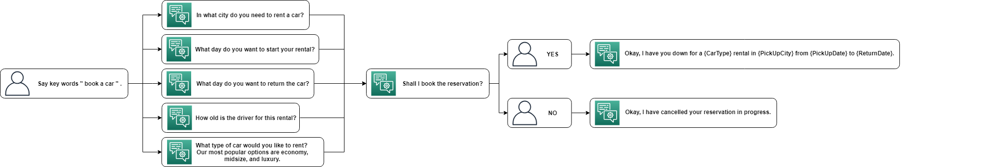

## 利用Amazon Lex 與 AWS Amplify 實作無服務器虛擬助理應用程式

## 前言

<center>

</center>

AWS Amplify 於 2018年底新增了一項功能，可支援 Amazon Sumerian 的 3D 場景整合於 AWS Amplify 的專案之中，現在可透過 AWS Amplify 迅速的將 Amazon Sumerian 場景部署於你的應用程式當中。 


AWS Amplify 是一個能輕鬆建立程式專案，並迅速部署 AWS 服務於專案之中，並提供簡單的架構將後端與常見的前端整合，作為一個全託管的服務，完全不需任何設定便可以讓應用程式後端可以隨需擴展。

Amazon Sumerian 是一個無須任何 3D 圖形的專業知識便可以輕鬆快速地打造虛擬實境 (VR)、擴增實境 (AR)、和 3D 應用程式，並可整合於各種常見的頭戴式裝置與行動裝置中。

Amazon Lex 是一個能部署在應用程式並使用語音或文字建立交談介面的服務，它提供自動語音辨識 (ASR) 的深度學習功能，將語音轉換為文字，再利用自然語言理解 (NLU) 來辨識文字的含義，讓使用者能夠體驗到逼真的交談與互動。


## 情境
我們可以根據不同情境設計 Amazon Lex 的對話主題並配合 AWS Amplify 可無限自動擴展的應用程式，我們可以完全不需要擔心後端程式與硬體的負載問題，只需要專注於主要程式碼的設計，便可迅速的將 Amazon Sumerian 擬真的人物場景部署於各項裝置中，適用於各項大型展場活動的互動式接待人員或各種模擬教學的教材。

## 使用環境

- 地區請選擇 US East (N. Virginia)
- 建議使用 [VScode](https://code.visualstudio.com/)，因為它能同時操作終端機與編輯專案。(或選用其他方式)

## 建置過程

### 利用 Amazon Lex 打造語音機器人

首先，我們為了簡化流程而選用 Amazon Lex 預設的 "BookTrip" 範本來打造這次語音機器人的主題。機器人會偵測設定好的關鍵語句來判斷使用者意圖，並回覆相關對話或做出對應行動，以此範本為例，機器人會不斷圍繞在 "BookTrip" 這個主題上詢問使用者，最後做出訂房或租車的動作。

- 在 __Service__ 選單中，選擇 __Amazon Lex__ 後，點選 __Create__ 來創建一個語音機器人。

- 選擇 __BookTrip__ 這個範本，輸入 __Bot name__ : `yourbotname` 後選擇 __Create__。

<center>

</center>

- 點入剛剛創建的語音機器人，開啟 __Settings__ 選項並選擇 __Aliases__。
    
    - 設定如下:

        - __Alias name__ : `test`

        - __Bot version__ : `latest`
        > 每次匯出機器人都需要設定 Alias name ，以區分的不同版本。 

- 點選 __PLUS__ 來增加一個新的版本。

<center>

</center>

- 選擇 __Publish__。

    - __Choose an alias__ : `test `，並選擇 __Publish__。

<center>

</center>

> 等待匯出結束後便可關閉網頁。

### 設計 AWS Amplify 專案

接著我們開啟 VScode 的終端機，使用 command line 來安裝 AWS Amplify CLI。(你也可以使用 Windows 的 " CMD命令提示字元 " 或 MacOS 的 " Terminal "來下安裝指令)

- [AWS Amplify CLI 安裝流程](https://aws-amplify.github.io/docs/)

- 使用 `npx create-react-app sumerian-amplify-app` 創建一個應用程式專案，在此命名為 `sumerian-amplify-app`。

> 專案預設路徑 __C:\Users\USER\sumerian-amplify-app__。

- 輸入 `cd sumerian-amplify-app` 指令，會進入專案資料夾。


- 輸入 `npm install aws-amplify aws-amplify-react --save` 來安裝 __aws-amplify__ 與 __aws-amplify-react__ 這兩個套件。


- 使用 [VScode](https://code.visualstudio.com/) 打開先前創好的 __sumerian-amplify-app__ 專案。

- 參考[附件](App.js)，修改 __App.js__ 中的程式碼。
    
    修改第 13 行的 `your_scene_region`。
    > 範例 : us-east-1。

    修改第 15 與 28 行的 `your_scene_name`。

- 在 __Index.css__ 中加入以下程式碼，調整 Sumerian 場景的顯示大小。

```
body {
  height: 600px;
}
```

### 替應用程式建立身分驗證
我們使用 AWS Amplify 建立應用程式的身分驗證功能，這只是 AWS Amplify 內建模組中的其中一個功能，倘若你需要替應用程式新增更多功能，請參考 [AWS Amplify](https://aws-amplify.github.io/docs/)。

- 輸入 `cd sumerian-amplify-app` 指令進入 __sumerian-amplify-app__ 資料夾。

- 輸入 `amplify add auth` ，選擇 __Yes__ 使用預設的 CloudFormation stack。

<center>

</center>

> AWS Amplify 會自動於 AWS Cognito 中新增 Identity pool。

- 輸入 `amplify push` 在雲端上同步剛剛的設定。

> 同步需要花三至五分鐘。


- 開啟 `sumerian-amplify-app`專案中的 __amplify__ 資料夾，打開 __amplify-meta.jason__。

<center>

</center>

- 記下 __UnauthRoleName__ 、 __AuthRoleName__ 與 __IdentityPoolName__，之後的步驟會使用到。


<center>

</center>

<center>

</center>


- 回到 AWS 主控台，選擇 __Services__，選擇 __IAM__。


- 選擇左側選單的 __Roles__，搜尋剛剛記下的 __UnAuthRoleName__ 並點擊進入。

- 選擇 __Add inline policy__。


<center>

</center>

- 選擇使用 __JSON__，貼上[附件](Policy.txt)程式碼。

- 選擇 __Review policy__，命名後選擇 __Create policy__.

    > 這個 IAM policy 能夠授權你的 Amazon Sumerian 場景能夠使用 Amazon Lex 的資源，並讓你的應用程式能夠讀取 Amazon Sumerian 場景。

- 對 __AuthRolename__ 進行與 __UnauthRolename__ 相同的新增步驟。
    > 新增 IAM policy。

- 回到 AWS 主控台選擇 __Services__ ，選擇 __Cognito__。 

- 選擇 __Manage Identity Pools__。

- 找尋剛剛複製的 __IdentityPoolName__ 並點入，然後在右上角選擇 __Edit identity pool__ 。

    > Cognito 這邊的主控台沒有搜尋功能，只能用找的。

- 展開 __Unauthenticated identities__，勾選 __Enable access to unauthenticated identities__ 。

<center>

</center>

- 複製 __Identity pool ID__，接下來的步驟會用到。

<center>

</center>

### 建立一個 Amazon Sumerian 場景
我們將新增一個場景，並加入用來說話的主持人(Maya)，再透過設定 __Dialogue Component__ 與先前建立好的 Amazon Lex 語音機器人做連結，賦予主持人(Maya)擁有語音對話的功能，最後再匯出一個不公開的 Amazon Sumerian 場景以便我們應用程式使用。

- 開啟 AWS 主控台選擇 __Service__，選擇 __Amazon Sumerian__ ，將會跳轉到 __Amazon Sumerian Dashboard__ 的網頁。


- 選擇 __Create new scene__，並替場景取一個 __Scene name__。

- 在左上角的 Entities 列表中點選 __yourscenename__，然後展開右邊列表的 __AWS Configuration__。

    >如果不先點選場景的話，可能不會看到右邊的列表。


<center>

</center>


- 展開 __AWS Configuration__ 列表，貼上剛剛複製的 __Cognito Identity Pool ID__。

    >此步驟是讓這個場景能夠使用剛剛在 Cognito 中所設定的權限。 

<center>

</center>

- 選擇 __Import Assets__，點選 __Maya__ 並點選右下角 __Add__。

<center>

</center>


- 需要將 __Maya__ 拖曳進場景之中才可以看到 __Maya__。

<center>

</center>

> 注意 : 你可能需要放大才看的到。

<center>

</center>


- 在左上角 Entities 清單選擇 __Maya__，並於右方列表選擇 __Add component__ 並選擇 __Dialogue__。


<center>

</center>

- 輸入先前創建的 Amazon Lex 語音機器人時的 __Bot Name__ 與 __Alias name__。


> Bot name 是自己取的 Amazon lex Bot 的名字，Alias name 則是 __test__。
    
> 此步驟是賦予 Maya 擁有 Amazon Lex 語音機器人的功能。


<center>

</center>


- 在左上角 Entities 清單選擇 __Maya__，並於右方點選 __Add component__ 選擇 __State Machine__。


<center>

</center>

- 展開右方清單中的 __State Machine__，選按 __PLUS__ 按鈕來新增一個新的動作元件。


<center>

</center>

- 替 __name__ 重新命名為 : `ChatBot`。

<center>

</center>

> 接著我們要替這個動作元件新增不同的狀態(state)。

- 替 __State 1__ 重新命名為 : `Start`，並選擇 __Add Action__。


<center>

</center>

- 搜尋 `AWS SDK Ready` 並選擇 __Add__ 來新增動作。


<center>

</center>


- 點擊 __Add State__ __5__ 次。 


<center>

</center>

-  依序替新增的動作階段命名 :

    __State 1__ : `Wait for Input`

    __State 2__ : `Start Recording`

    __State 3__ : `Stop Recording`

    __State 4__ : `Process with Lex`

    __State 5__ : `Play Response`


<center>

</center>

- 選擇 __Wait for Input__，新增一個 __Key Down__ 的動作。

<center>

</center>

- 更改觸發按鍵。
    > 可依照喜好或裝置差異而設定觸發按鍵。


<center>

</center>

- 選擇 __Start Recording__，新增 __Start Microphone Recording__ 和 __Key Up__ 這兩個動作。


<center>

</center>


- 選擇 __Stop Recording__，新增 __Stop Microphone Recording__ 這個動作。

    > 可依照喜好或裝置差異而設定觸發按鍵。

<center>

</center>


- 選擇 __Process with Lex__，新增 __Send Audio Input to Dialogue Bot__ 這個動作。


<center>

</center>

> 不要勾選 Log user input 和 Log bot respons。


- 選擇 __Play Response__，新增 __Start Speech__ 並勾選 __Use Lex Response__。


<center>

</center>


- 透過 __拖曳箭頭__ 的方式替階段新增順序。 

    > 在 "Process With Lex" 這個階段的順序，請從 "On Response Ready output" 開始拖曳。


<center>

</center>

> 完成後如下圖。

<center>

</center>


> 注意 : Amazon Sumerian 會定期自動存檔，但仍建議定期點選左上角選單手動存檔。

- 點選右上角 __Publish__，選擇 __Host privately__ 後，選擇 __Publish__。

<center>

</center>

> 如果已經是匯出的狀態，請先 __Unpublish__ 然後再次 __Publish__。

<center>

</center>

- 不公開匯出會是一個 JSON 檔，請 __Download JSON configuration__。

- 將下載的 JSON 檔複製到我們專案的 __src__ 資料夾中並改名 `sumerian-exports.js`。


<center>

</center>

- 修改 __sumerian-export.js__ 如下圖。

<center>

</center>


### 匯出可讓頭戴式與行動裝置開啟的應用程式


- 輸入 `amplify add hosting` 指令，開始進行匯出設定。

- 選擇 __DEV__。

<center>

</center>

- 輸入你的 __hosting bucket name__，並選擇下圖之設定 :


<center>

</center>

> 設定完成後，AWS Amplify 可會自動建立一個 S3 Bucket。

- 輸入 `amplify publish` 指令，匯出應用程式。

<center>

</center>


> 匯出成一個 URL，可利用任何頭戴式裝置或行動裝置開啟，倘若沒有頭戴式裝置可以使用瀏覽器開啟。

- 進行 __Create account__ 與 __Login__ 後便會進入此頁面。

<center>

</center>

<center>

</center>

- 按著 __觸發按鍵__ 便可與她對話。

    > 說出 "Book a hotel" 或 "Book a car" 這兩個關鍵字可以觸發回應。

<center>

</center>

<center>

</center>

 

## 結論
現在你學會了如何安裝與設定 AWS Amplify CLI 以及利用 AWS Amplify 創建應用程式。也學會如何建立 Amazon Sumerian 場景，並加入主持人與 Amazon Lex 的語音機器人做連結，並透過不公開的方式將 Amazon Sumerian 場景匯出，整合於你的應用程式或其他裝置中，創造出屬於自己的虛擬語音助理。


## 參考網址
- [Using the Dialogue Component and Amazon Lex to Build a Chatbot](https://docs.sumerian.amazonaws.com/tutorials/create/beginner/dialogue-component/)

- [AWS Amplify](https://aws-amplify.github.io/docs/)

- [AWS Amplify Tutorial](https://github.com/aws-amplify/amplify-cli#tutorials)

- [Amazon Lex Programming Model](https://docs.aws.amazon.com/zh_tw/lex/latest/dg/programming-model.html)